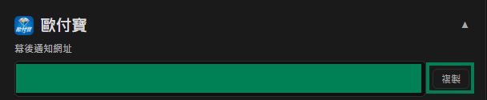

# O'Pay Settings

This tutorial explains how to obtain the **HashKey** and **HashIV** from O'Pay and enter them into Stream Toolkit.

## Step 1: Log in to the O'Pay Merchant Dashboard

1. Go to the [O'Pay official website](https://www.opay.tw/) and log in
2. After logging in, click the top right corner to enter the merchant dashboard

   

:::note
If you don't have an O'Pay account yet, you must first complete the store application and identity verification.
:::

## Step 2: System Development Management

1. Find **System Development Management** in the left menu
2. Click **System Integration Settings**

## Step 3: Fill in Stream Toolkit

1. Open Stream Toolkit
2. Click **Settings** in the bottom left menu
3. Find **O'Pay** in **Donation Platform Integration**
4. Paste the **ALL IN ONE Integration HashKey** and **ALL IN ONE Integration HashIV** from **System Integration Settings** into the **Hash Key** and **Hash IV** fields, respectively

   

5. Click **Save**

   

## Step 4: Set Notification URL

1. Copy the O'Pay **Webhook URL**

   

2. Return to the [O'Pay official website](https://www.opay.tw/) and click **Receive Payments** → **Streamer Payment Settings**

   

3. Paste the **Webhook URL** into the **Donation Payment Success Notification URL** field

   

4. Click **Save Settings**

## FAQ

**Q: Can't find the "System Development Management" menu?**
This means your account has not been approved yet, or the relevant payment features have not been enabled. Please contact O'Pay customer service.

**Q: Can HashKey be made public?**
No. HashKey and HashIV are private keys; please do not share screenshots or post them in public.
