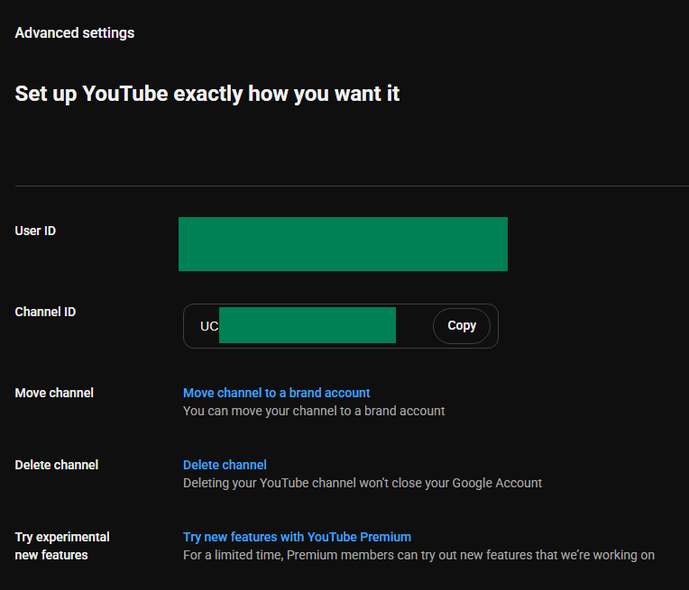

# YouTube API 設定

本教學說明如何取得 YouTube Data API 的 **API Key** 和**頻道 ID**，用於`實況精華標記`功能。

## YouTube Data API

### 步驟一：開啟 Google Cloud Console

1. 前往 [Google Cloud Console](https://console.cloud.google.com)
2. 用你的 Google 帳號登入

### 步驟二：啟用 YouTube Data API v3

1. 在上方搜尋列搜尋 `YouTube Data API v3`

   

2. 點擊搜尋結果
3. 點擊 **Enable**

   

### 步驟三：建立 API 金鑰

1. 點擊左方 **Credentials**

   

2. 點選 **Create credentials** → **API Key**

   

### 步驟四：設定 API 金鑰

1. **Name** 隨意填（例如：`StreamToolkit`）
2. **Select API restrictions** 勾選 `YouTube Data API v3` 後按 **OK**

   

3. **Authenticate API calls through a service account** 不勾選
4. **Application restrictions** 選 **None**

   

5. 點擊 **Create**

### 步驟五：填入 App

1. 將得到的 API Key 貼入 App 中 **YouTube API** 欄位

## 頻道 ID

### 步驟一：開啟 YouTube 設定

1. 前往 [YouTube](https://www.youtube.com)
2. 點選右上角大頭貼
3. 選擇 **設定**

### 步驟二：取得 Channel ID

1. 左側欄位選擇 **進階設定**

   

2. 將 **Channel ID** 複製後貼回 App

   

## 常見問題

**Q：API 金鑰有使用量限制嗎？**
有。YouTube Data API v3 每天免費額度為 10,000 單位。一般直播用量不會超過。

**Q：出現「API Key 無效」錯誤？**
確認 YouTube Data API v3 已啟用，且使用的是正確專案的金鑰。

**Q：金鑰可以公開嗎？**
不建議。若金鑰外洩被濫用，你的每日配額會被快速耗盡。
