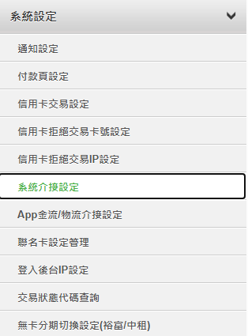

# Nastavení ECPay

Tento návod vysvětluje, jak získat **HashKey** a **HashIV** od ECPay a zadat je do Stream Toolkit.

## Krok 1: Přihlaste se do obchodního centra ECPay

1. Přejdete na [oficiální web ECPay](https://www.ecpay.com.tw/)
2. Klikněte v pravém horním rohu na **Přihlášení prodejce** → **Obchodní zóna**

## Krok 2: Přejděte do Nastavení systémové integrace

1. V levém menu klikněte na **Nastavení systému**
2. Vyberte **Nastavení systémové integrace**

   

3. Najděte **Integrační Hash Key** a **Integrační Hash IV**

   

## Krok 3: Zadejte do Stream Toolkit

1. Otevřete Stream Toolkit
2. Klikněte na **Nastavení** v levém dolním menu
3. V **Napojení platforem pro příspěvky** najděte **ECPay**
4. Vložte **Integrační HashKey** a **Integrační HashIV** z **Nastavení systémové integrace** do polí **Hash Key** a **Hash IV**
5. Klikněte na **Uložit**

## Krok 4: Nastavení notifikační URL

1. Zkopírujte **URL pro notifikace na pozadí** od ECPay

   

2. V obchodním centru ECPay najděte **Platební nástroje** → **Platby pro streamery**

   

3. Vložte **URL pro notifikace na pozadí** do pole **URL pro zpětnou vazbu o dokončené platbě**

   

4. Klikněte na **Uložit nastavení**

## Často kladené otázky

**Q: Po přihlášení nevidíte "Nastavení systému"?**
Váš účet možná ještě nedokončil proces ověření. Přejděte do "Správa údajů o obchodníkovi" a zkontrolujte stav.

**Q: Může být HashKey veřejný?**
Ne. HashKey a HashIV jsou soukromé klíče; nesdílejte prosím snímky obrazovky ani je nezveřejňujte na veřejných místech.
