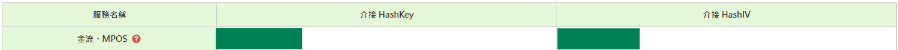

# ECPay-Einstellungen

Dieses Tutorial erklärt, wie Sie den **HashKey** und den **HashIV** von ECPay erhalten und in Stream Toolkit eingeben.

## Schritt 1: Im ECPay Händler-Dashboard anmelden

1. Besuchen Sie die [offizielle ECPay-Website](https://www.ecpay.com.tw/)
2. Klicken Sie oben rechts auf **Verkäufer-Login** → **Händlerbereich**

## Schritt 2: Zu Systemintegrations-Einstellungen gehen

1. Klicken Sie im linken Menü auf **Systemeinstellungen**
2. Wählen Sie **Systemintegrations-Einstellungen**

   

3. Finden Sie den **Integrations-Hash Key** und den **Integrations-Hash IV**

   

## Schritt 3: In Stream Toolkit eingeben

1. Öffnen Sie Stream Toolkit
2. Klicken Sie im linken unteren Menü auf **Einstellungen**
3. Finden Sie **ECPay** unter **Spendenplattform-Anbindung**
4. Fügen Sie den **Integrations-HashKey** und den **Integrations-HashIV** aus den **Systemintegrations-Einstellungen** in die entsprechenden **Hash Key**- und **Hash IV**-Felder ein
5. Klicken Sie auf **Speichern**

## Schritt 4: Benachrichtigungs-URL einrichten

1. Kopieren Sie die **Benachrichtigungs-URL** von ECPay

   

2. Finden Sie im ECPay Händler-Dashboard **Zahlungstools** → **Streamer-Zahlungen**

   

3. Fügen Sie die **Benachrichtigungs-URL** in das Feld **URL für Rückmeldung der Zahlungsabschlussbenachrichtigung** ein

   

4. Klicken Sie auf **Einstellungen speichern**

## Häufig gestellte Fragen (FAQ)

**Q: "Systemeinstellungen" nach dem Login nicht sichtbar?**
Möglicherweise ist die Kontoprüfung noch nicht abgeschlossen. Bitte gehen Sie zur "Händlerdatenverwaltung", um den Status zu überprüfen.

**Q: Kann der HashKey öffentlich gemacht werden?**
Nein. HashKey und HashIV sind private Schlüssel; bitte geben Sie keine Screenshots weiter und veröffentlichen Sie diese nicht öffentlich.
