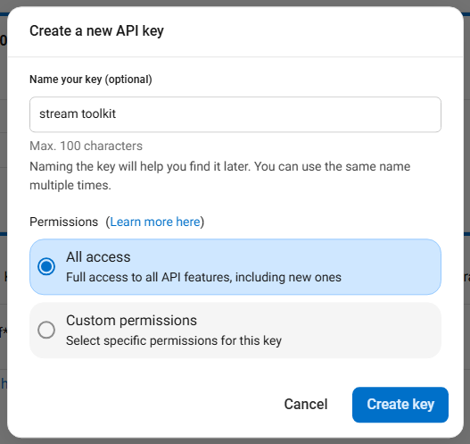

# DeepL API-Key abrufen

Der DeepL API-Key wird für die automatische Übersetzung der folgenden Funktionen verwendet:
- **Sprachübersetzung** — Automatische Übersetzung nach Umwandlung von Sprache in Text
- **Chat** — Automatische Übersetzung von Zuschauernachrichten

## Schritt 1: Bei Ihrem DeepL-Konto anmelden

Besuchen Sie [DeepL](https://www.deepl.com) und melden Sie sich bei Ihrem Konto an. Wenn Sie noch kein Konto haben, müssen Sie sich zuerst registrieren.

## Schritt 2: Account-Einstellungen aufrufen

Klicken Sie oben rechts auf das **Profilsymbol** und wählen Sie **Account**.

## Schritt 3: Zum Tab API Keys & limits wechseln

Klicken Sie auf den Tab **API Keys & limits**.

## Schritt 4: Neuen API Key erstellen

1. Klicken Sie auf **Create key +**
2. **Name your key**: Geben Sie einen beliebigen Namen ein (z. B. `Stream Toolkit`)
3. **Permissions**: Wählen Sie **All access**
4. Klicken Sie auf **Create Key**

## Schritt 5: Kopieren und in die App einfügen

1. Kopieren Sie den generierten API Key
2. Kehren Sie zu Stream Toolkit zurück und fügen Sie es in das entsprechende Feld **DeepL API Key** ein

## Häufig gestellte Fragen (FAQ)

**Q: Hat die kostenlose Testversion von DeepL Nutzungsgrenzen?**
Ja. Die kostenlose Testversion bietet ein Kontingent von 1.000.000 Zeichen und ist auf einen Monat begrenzt. Für eine kontinuierliche Nutzung hochwertiger Übersetzungen abonnieren Sie bitte einen kostenpflichtigen DeepL-Plan.

**Q: Was tun, wenn mein API Key geleakt wurde?**
Gehen Sie zurück zu DeepL Account → API Keys & limits, löschen Sie den alten Key und erstellen Sie einen neuen.
