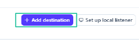
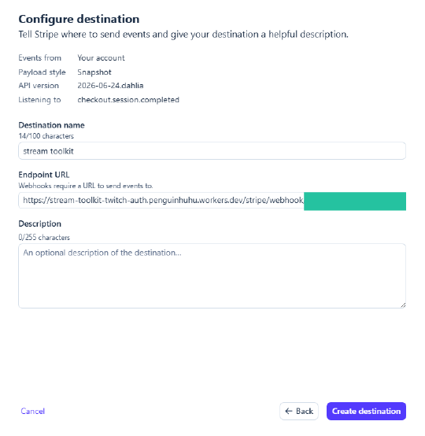

# Configuración de Stripe

Stream Toolkit recibe notificaciones de pago de Stripe a través de Webhooks. La configuración se divide en dos partes: obtener la URL de Webhook desde la app e integrar la conexión en el panel de Stripe.

## Paso 1: Obtener la URL de Webhook en Stream Toolkit

1. Abre Stream Toolkit
2. Haz clic en **Configuración** en el menú de la parte inferior izquierda → **Integración de plataformas de donaciones** → **Stripe** (Haz clic para expandir)
3. Verás la **Webhook URL**, con el siguiente formato:
   ```
   https://<worker>/stripe/webhook/<your userId>
   ```
4. Haz clic en el botón **Copiar** y guarda esta URL para usarla más adelante


## Paso 2: Añadir un Webhook en el panel de Stripe

1. Ve a [Stripe Dashboard](https://dashboard.stripe.com) e inicia sesión en tu cuenta
2. Haz clic en **Desarrolladores** → **Webhooks** en la esquina inferior izquierda


3. Haz clic en **Añadir punto de conexión**



4. Completa la siguiente información:
   - **Eventos**: Busca y marca `checkout.session.completed` (solo se necesita este)

   

   - **Tipo de punto de conexión**: Selecciona **Punto de conexión de Webhook**

   

   - **Nombre del punto de conexión**: Escribe lo que quieras (por ejemplo, `Stream Toolkit`)
   - **URL del punto de conexión**: Pega la URL de Webhook copiada en el Paso 1

   

5. Haz clic en **Añadir punto de conexión**

## Paso 3: Introducir la clave secreta de firma

1. Una vez creado el Webhook, la página mostrará la **clave secreta de firma** con el formato `whsec_...`
2. Copia esta clave secreta
3. Vuelve a la sección de configuración de Stripe en Stream Toolkit
4. Pega la clave secreta en el campo **Clave secreta de firma del Webhook**
5. Haz clic en **Guardar**

El cambio del estado de conexión a verde indica que la configuración se ha realizado correctamente.


## Completado

Una vez finalizada la configuración, cuando los espectadores paguen a través de tu **Payment Link** de Stripe, Stream Toolkit recibirá notificaciones en tiempo real y mostrará la donación.

## Preguntas frecuentes

**Q: ¿Dónde puedo crear un Payment Link?**
Ve al Stripe Dashboard → **Payment Links** → **Crear Payment Link**, configura el monto y comparte el enlace con tus espectadores.

**Q: ¿El estado de la conexión no está en verde?**
Asegúrate de que la Clave secreta de firma del Webhook se haya pegado y guardado correctamente, y que la URL del punto de conexión en el panel de Stripe coincida exactamente con la que se muestra en la app.
