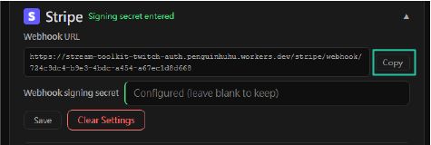

# Paramètres Stripe

Stream Toolkit reçoit les notifications de paiement Stripe via des Webhooks. La configuration se divise en deux parties : obtenir l'URL du Webhook depuis l'app, et finaliser l'intégration dans l'espace client Stripe.

## Étape 1 : Obtenir l'URL du Webhook dans Stream Toolkit

1. Ouvrez Stream Toolkit
2. Cliquez sur **Réglages** dans le menu en bas à gauche → **Intégration des plateformes de dons** → **Stripe** (Cliquer para développer)
3. Vous verrez l'**Webhook URL**, au format suivant :
   ```
   https://<worker>/stripe/webhook/<your userId>
   ```
4. Cliquez sur le bouton **Copier** et conservez cette URL pour une utilisation ultérieure



## Étape 2 : Ajouter un Webhook dans l'espace client Stripe

1. Accédez à [Stripe Dashboard](https://dashboard.stripe.com) et connectez-vous à votre compte
2. Cliquez sur **Développeurs** → **Webhooks** en bas à gauche


3. Cliquez sur **Ajouter un point de terminaison**


4. Remplissez les informations suivantes :
   - **Événements** : Recherchez et cochez `checkout.session.completed` (uniquement celui-ci)

   

   - **Type de point de terminaison** : Sélectionnez **Point de terminaison Webhook**

   

   - **Nom du point de terminaison** : Saisissez le nom de votre choix (par exemple, `Stream Toolkit`)
   - **URL du point de terminaison** : Collez l'URL du Webhook copiée à l'étape 1

   

5. Cliquez sur **Ajouter un point de terminaison**

## Étape 3 : Saisir la clé secrète de signature

1. Une fois le Webhook créé, la page affichera la **clé secrète de signature** au format `whsec_...`
2. Copiez cette clé secrète
3. Retournez dans la section des paramètres Stripe de Stream Toolkit
4. Collez la clé secrète dans le champ **Clé secrète de signature du Webhook**
5. Cliquez sur **Enregistrer**

La configuration est réussie lorsque le statut de connexion passe au vert.


## Terminé

Une fois la configuration terminée, lorsque les spectateurs paieront via votre **Payment Link** Stripe, Stream Toolkit recevra des notifications en temps réel et affichera le don.

## Questions fréquentes

**Q : Où puis-je créer un Payment Link ?**
Accédez au Stripe Dashboard → **Payment Links** → **Créer un Payment Link**, définissez le montant et partagez le lien avec vos spectateurs.

**Q : Le statut de connexion n'est pas passé au vert ?**
Assurez-vous que la Clé secrète de signature du Webhook a bien été collée et enregistrée, et que l'URL du point de terminaison dans l'espace client Stripe correspond exactement à celle affichée dans l'app.
