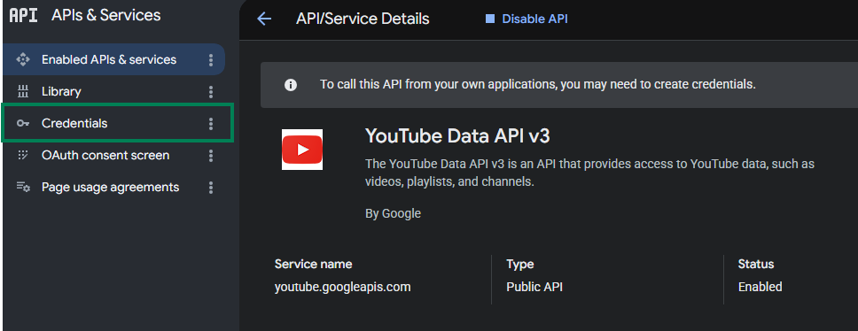

# Paramètres de l'API YouTube

Ce tutoriel explique comment obtenir l'**API Key** et l'**identifiant de chaîne** pour l'YouTube Data API, utilisés pour la fonctionnalité `Marqueur de temps fort du stream`.

## YouTube Data API

### Étape 1 : Ouvrir Google Cloud Console

1. Accédez à [Google Cloud Console](https://console.cloud.google.com)
2. Connectez-vous avec votre compte Google

### Étape 2 : Activer l'YouTube Data API v3

1. Recherchez `YouTube Data API v3` dans la barre de recherche supérieure

   

2. Cliquez sur le résultat de la recherche
3. Cliquez sur **Enable**

   

### Étape 3 : Créer une clé API

1. Cliquez sur **Credentials** à gauche

   

2. Sélectionnez **Create credentials** → **API Key**

   

### Étape 4 : Configurer la clé API

1. Saisissez le **Name** de votre choix (par ex. : `StreamToolkit`)
2. Dans **Select API restrictions**, cochez `YouTube Data API v3` puis cliquez sur **OK**

   

3. Ne cochez pas **Authenticate API calls through a service account**
4. Dans **Application restrictions**, sélectionnez **None**

   

5. Cliquez sur **Create**

### Étape 5 : Saisir dans l'App

1. Collez l'API Key obtenue dans le champ **YouTube API** de l'App

## Identifiant de chaîne

### Étape 1 : Ouvrir les paramètres de YouTube

1. Accédez à [YouTube](https://www.youtube.com)
2. Cliquez sur votre photo de profil en haut à droite
3. Sélectionnez **Paramètres**

### Étape 2 : Obtenir l'identifiant de chaîne

1. Dans le menu de gauche, sélectionnez **Paramètres avancés**

   

2. Copiez l'**identifiant de chaîne** et collez-le dans l'App

   

## Questions fréquentes

**Q : La clé API a-t-elle des limites d'utilisation ?**
Oui. L'YouTube Data API v3 dispose d'un quota quotidien gratuit de 10 000 unités. Une utilisation standard en streaming ne dépassera pas cette limite.

**Q : Une erreur « API Key non valide » s'affiche ?**
Vérifiez que l'YouTube Data API v3 est activée et que vous utilisez la clé du bon projet.

**Q : La clé peut-elle être rendue publique ?**
Non recommandé. Si votre clé est divulguée et exploitée, votre quota quotidien sera rapidement épuisé.
