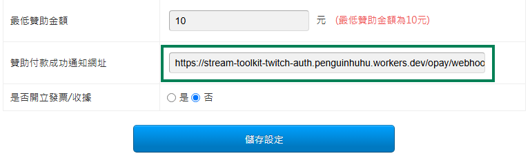

# Pengaturan O'Pay

Tutorial ini menjelaskan cara mendapatkan **HashKey** dan **HashIV** dari O'Pay dan memasukkannya ke dalam Stream Toolkit.

## Langkah 1: Login ke dasbor merchant O'Pay

1. Buka [situs resmi O'Pay](https://www.opay.tw/) dan login
2. Setelah login, klik pojok kanan atas untuk masuk ke dasbor merchant

   

:::note
Jika Anda belum memiliki akun O'Pay, Anda harus menyelesaikan permohonan toko dan verifikasi identitas terlebih dahulu.
:::

## Steg 2: Systemutvecklingshantering

1. Temukan **Manajemen Pengembangan Sistem** di menu sebelah kiri
2. Klik **Pengaturan Integrasi Sistem**

## Langkah 3: Masukkan ke Stream Toolkit

1. Buka Stream Toolkit
2. Klik **Pengaturan** pada menu kiri bawah
3. Temukan **O'Pay** di **Integrasi platform donasi**
4. Tempel **ALL IN ONE HashKey Integrasi** dan **ALL IN ONE HashIV Integrasi** dari **Pengaturan Integrasi Sistem** ke kolom **Hash Key** dan **Hash IV** masing-masing

   

5. Klik **Simpan**

   

## Langkah 4: Atur URL Notifikasi

1. Salin **URL notifikasi latar** O'Pay

   

2. Kembali ke [situs resmi O'Pay](https://www.opay.tw/) dan klik **Terima Pembayaran** → **Pengaturan Pembayaran Streamer**

   

3. Tempel **URL notifikasi latar** ke kolom **URL notifikasi pembayaran donasi berhasil**

   

4. Klik **Simpan Pengaturan**

## Pertanyaan Umum

**Q: Tidak dapat menemukan menu "Manajemen Pengembangan Sistem"?**
Ini berarti akun Anda belum disetujui, atau fitur pembayaran terkait belum diaktifkan. Silakan hubungi layanan pelanggan O'Pay.

**Q: Bisakah HashKey dipublikasikan?**
Tidak. HashKey dan HashIV adalah kunci pribadi; mohon jangan bagikan tangkapan layar atau mempostingnya di tempat umum.
