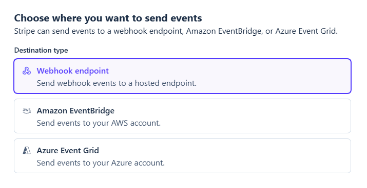

# Pengaturan Stripe

Stream Toolkit menerima notifikasi pembayaran Stripe melalui Webhook. Pengaturan dibagi menjadi dua bagian: mendapatkan URL Webhook dari app, dan menyelesaikan integrasi di dasbor Stripe.

## Langkah 1: Dapatkan URL Webhook di Stream Toolkit

1. Buka Stream Toolkit
2. Klik **Pengaturan** pada menu kiri bawah → **Integrasi platform donasi** → **Stripe** (Klik untuk memperluas)
3. Anda akan melihat **Webhook URL**, dengan format sebagai berikut:
   ```
   https://<worker>/stripe/webhook/<your userId>
   ```
4. Klik tombol **Salin** dan simpan URL ini untuk digunakan nanti


## Langkah 2: Tambah Webhook di dasbor Stripe

1. Buka [Stripe Dashboard](https://dashboard.stripe.com), lalu login ke akun Anda
2. Klik **Developer** → **Webhook** ở pojok kiri bawah


3. Klik **Tambah endpoint**


4. Isi informasi berikut:
   - **Peristiwa**: Cari dan centang `checkout.session.completed` (hanya butuh yang satu ini)

   

   - **Jenis endpoint**: Pilih **Endpoint Webhook**

   

   - **Nama endpoint**: Isi bebas (misalnya `Stream Toolkit`)
   - **URL Endpoint**: Tempel URL Webhook yang disalin dari Langkah 1

   

5. Klik **Tambah endpoint**

## Langkah 3: Masukkan Kunci Rahasia Tanda Tangan

1. Setelah Webhook berhasil dibuat, halaman akan menampilkan **kunci rahasia tanda tangan** dengan format `whsec_...`
2. Salin kunci rahasia ini
3. Kembali ke bagian pengaturan Stripe di Stream Toolkit
4. Tempel kunci rahasia ke dalam kolom **Kunci rahasia tanda tangan Webhook**
5. Klik **Simpan**

Status koneksi berubah menjadi hijau menandakan pengaturan telah berhasil.


## Selesai

Setelah pengaturan selesai, saat penonton membayar melalui Stripe **Payment Link** Anda, Stream Toolkit akan langsung menerima notifikasi dan menampilkan donasi.

## Pertanyaan Umum

**Q: Di mana saya bisa membuat Payment Link?**
Buka Stripe Dashboard → **Payment Links** → **Buat Payment Link**, atur jumlahnya, lalu bagikan tautannya kepada penonton Anda.

**Q: Status koneksi tidak berubah menjadi hijau?**
Pastikan Kunci rahasia tanda tangan Webhook telah ditempel dan disimpan dengan benar, serta URL endpoint di dasbor Stripe sama persis dengan yang ditampilkan di app.
