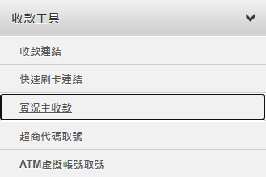

# Impostazioni ECPay

Questo tutorial spiega come ottenere **HashKey** e **HashIV** da ECPay e inserirli in Stream Toolkit.

## Passaggio 1: Accedi alla dashboard commerciante ECPay

1. Vai al [sito ufficiale di ECPay](https://www.ecpay.com.tw/)
2. Clicca nell'angolo in alto a destra su **Login venditore** → **Area commerciante**

## Passaggio 2: Vai a Impostazioni integrazione sistema

1. Clicca su **Impostazioni di sistema** nel menu a sinistra
2. Seleziona **Impostazioni integrazione sistema**

   

3. Trova **Hash Key di integrazione** e **Hash IV di integrazione**

   

## Passaggio 3: Inserisci in Stream Toolkit

1. Apri Stream Toolkit
2. Clicca su **Impostazioni** nel menu in basso a sinistra
3. Trova **ECPay** in **Integrazione piattaforme di donazione**
4. Incolla **HashKey di integrazione** e **HashIV di integrazione** dalle **Impostazioni integrazione sistema** nei rispettivi campi **Hash Key** e **Hash IV**
5. Clicca su **Salva**

## Passaggio 4: Imposta l'URL di notifica

1. Copia l'**URL di notifica backend** di ECPay

   

2. Nella dashboard commerciante ECPay, trova **Strumenti di pagamento** → **Pagamenti streamer**

   

3. Incolla l'**URL di notifica backend** nel campo **URL di ritorno notifica pagamento completato**

   

4. Clicca su **Salva impostazioni**

## Domande frequenti

**Q: Non vedi "Impostazioni di sistema" dopo aver effettuato l'accesso?**
È possibile che il tuo account non abbia completato il processo di verifica. Vai in "Gestione dati commerciante" per verificare lo stato.

**Q: Il HashKey può essere reso pubblico?**
No. HashKey e HashIV sono chiavi private; si prega di non condividere screenshot o pubblicarle in luoghi pubblici.
