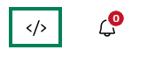

# Impostazioni PayPal

Stream Toolkit utilizza i Webhook para ricevere le notifiche di pagamento di PayPal, quindi non è necessario inserire una chiave API.

## Passaggio 1: Ottieni l'URL del Webhook in Stream Toolkit

1. Apri Stream Toolkit
2. Clicca su **Impostazioni** nel menu in basso a sinistra
3. Trova **Integrazione piattaforme di donazione** → **PayPal**
4. Clicca sul pulsante **Ottieni URL**
5. Una volta generato l'URL, clicca sul pulsante **Copia**

:::warning Attenzione
L'URL del Webhook contiene un token esclusivo, si prega di non condividerlo pubblicamente. Se si sospetta una fuga di dati, è possibile cliccare su **Rigenera URL** per emettere un nuovo URL (il vecchio URL diventerà immediatamente non valido).
:::

## Passaggio 2: Accedi alla dashboard sviluppatori di PayPal

1. Vai su [PayPal Developer](https://developer.paypal.com)
2. Clicca su **Log in to Dashboard** in alto a destra e accedi con il tuo account PayPal
3. Dopo l'accesso, clicca sul pulsante **`</>`** in alto a destra per accedere alla dashboard sviluppatori

## Passaggio 3: Passa alla modalità Live

Assicurati che l'interruttore di modalità sopra il menu a sinistra sia impostato su **Live**. È necessario cambiare solo se mostra **Sandbox** (modalità di test):

1. Trova l'interruttore a levetta sopra il menu a sinistra
2. Clicca per passare a **Live**

## Passaggio 4: Vai alle impostazioni dei Webhook

1. Nel menu a sinistra clicca su **Apps & Credentials**

   

2. Trova il pulsante **Manage Webhooks** nella pagina e cliccaci sopra per accedere

   

3. Scorri fino in fondo alla pagina e clicca su **Add Webhook**

   

## Passaggio 5: Aggiungi Webhook

1. Incolla l'URL appena copiato da Stream Toolkit nel campo **Webhook URL**
2. In **Event types**, trova la categoria **Payments & payouts** e seleziona:
   - ✅ `Payment capture completed`
   - ✅ `Payment sale completed`
3. Clicca su **Save**

{/* TODO: 截圖 — Add Webhook 設定頁 */}

Una volta completate le impostazioni, quando gli spettatori effettuano pagamenti tramite PayPal, Stream Toolkit riceverá le notifiche in tempo reale.

## Domande frequenti

**Q: È possibile eseguire test in modalità Sandbox?**
Sì. In modalità Sandbox puoi comunque aggiungere un Webhook per testare il flusso di pagamento, ma non riceverai denaro reale.

**Q: Cosa fare se l'URL del Webhook viene rigenerato?**
Devi tornare nella dashboard di PayPal e sostituire il vecchio URL del Webhook con quello nuovo.
