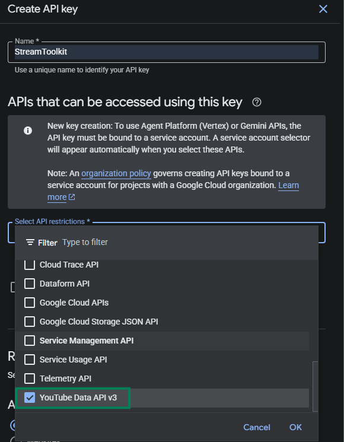

# Impostazioni API di YouTube

Questo tutorial spiega come ottenere la **API Key** e l'**ID del canale** per la YouTube Data API, utilizzati per la funzione `Marcatore momenti salienti stream`.

## YouTube Data API

### Passaggio 1: Apri Google Cloud Console

1. Vai su [Google Cloud Console](https://console.cloud.google.com)
2. Accedi con il tuo account Google

### Passaggio 2: Abilita YouTube Data API v3

1. Cerca `YouTube Data API v3` nella barra di ricerca in alto

   

2. Clicca sul risultato della ricerca
3. Clicca su **Enable**

   

### Passaggio 3: Crea chiave API

1. Clicca su **Credentials** a sinistra

   

2. Seleziona **Create credentials** → **API Key**

   

### Passaggio 4: Configura chiave API

1. Inserisci un **Name** a piacere (ad esempio: `StreamToolkit`)
2. In **Select API restrictions** spunta `YouTube Data API v3` e clicca su **OK**

   

3. Non spuntare **Authenticate API calls through a service account**
4. In **Application restrictions** seleziona **None**

   

5. Clicca su **Create**

### Passaggio 5: Inserisci nell'App

1. Incolla l'API Key ottenuta nel campo **YouTube API** dell'App

## ID del canale

### Passaggio 1: Apri le impostazioni di YouTube

1. Vai su [YouTube](https://www.youtube.com)
2. Clicca sulla tua foto del profilo in alto a droite
3. Seleziona **Impostazioni**

### Passaggio 2: Ottieni ID del canale

1. Nel menu a sinistra seleziona **Impostazioni avanzate**

   

2. Copia l'**ID del canale** e incollalo di nuovo nell'App

   

## Domande frequenti

**Q: La chiave API ha limiti di utilizzo?**
Sì. La YouTube Data API v3 ha una quota giornaliera gratuita di 10.000 unità. Il normale utilizzo per lo streaming nao la supererà.

**Q: Viene visualizzato l'errore "API Key non valida"?**
Assicurati che la YouTube Data API v3 sia abilitata e che tu stia utilizzando la chiave del progetto corretto.

**Q: La chiave può essere resa pubblica?**
Non consigliato. Se la chiave viene trapelata e abusata, la tua quota giornaliera si esaurirà rapidamente.
