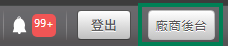

# O'Pay 設定

このチュートリアルでは、O'Pay から **HashKey** と **HashIV** を取得し、Stream Toolkit に入力する方法を説明します。

## ステップ 1：O'Pay 加盟店管理画面にログイン

1. [O'Pay 公式サイト](https://www.opay.tw/) にアクセスしてログインします
2. ログイン後、右上のメニューから加盟店管理画面に入ります

   

:::note
O'Pay アカウントをまだお持ちでない場合は、先にショップの申請と本人確認を完了する必要があります。
:::

## Schritt 2: Systementwicklungsverwaltung

1. 左側メニューで **システム開発管理** を見つけます
2. **システム連携設定** をクリックします

## ステップ 3：Stream Toolkit に入力

1. Stream Toolkit を起動します
2. 左下のメニューの **設定** をクリックします
3. **サポートプラットフォーム連携** で **O'Pay** を探します
4. **システム連携設定** にある **ALL IN ONE 連携 HashKey** と **ALL IN ONE 連携 HashIV** を、それぞれ **Hash Key** と **Hash IV** 欄に入力します

   

5. **保存** をクリックします

   

## ステップ 4：通知 URL の設定

1. O'Pay の **バックグラウンド通知 URL** をコピーします

   

2. [O'Pay 公式サイト](https://www.opay.tw/) に戻り、**支払いを受け取る** → **配信者向け支払い設定** をクリックします

   

3. **バックグラウンド通知 URL** を **寄付支払い成功通知 URL** 欄に貼り付けます

   

4. **設定を保存** をクリックします

## よくある質問

**Q：「システム開発管理」メニューが見つかりませんか？**
これは、アカウントがまだ承認されていないか、関連する決済機能が有効になっていないことを意味します。O'Pay カスタマーサポートまでお問い合わせください。

**Q：HashKey は公開しても大丈夫ですか？**
いいえ。HashKey と HashIV はプライベートキーです。スクリーンショットを共有したり、公開の場に投稿したりしないでください。
