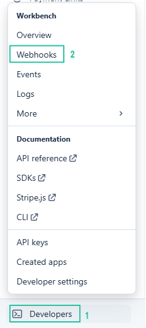

# Stripe 設定

Stream Toolkit は Webhook を介して Stripe の決済通知を受信します。設定は、app から Webhook URL を取得することと、Stripe の管理画面で連携を完了することの2つのステップに分かれています。

## ステップ 1：Stream Toolkit で Webhook URL を取得

1. Stream Toolkit を起動します
2. 左下のメニューの **設定** → **サポートプラットフォーム連携** → **Stripe**（クリックして展開）をクリックします
3. 以下のような形式の **Webhook URL** が表示されます：
   ```
   https://<worker>/stripe/webhook/<your userId>
   ```
4. **コピー** ボタンをクリックし、この URL を控えとして保存します


## ステップ 2：Stripe の管理画面で Webhook を追加

1. [Stripe Dashboard](https://dashboard.stripe.com) に移動し、アカウントにログインします
2. 左下の **開発者向け** → **Webhook** をクリックします



3. **エンドポイントを追加** をクリックします


4. 以下の情報を入力します：
   - **イベント**：`checkout.session.completed` を検索してチェックを入れます（これだけで十分です）

   

   - **エンドポイントのタイプ**：**Webhook エンドポイント** を選択します

   

   - **エンドポイント名**：任意の名前を入力します（例：`Stream Toolkit`）
   - **エンドポイント URL**：ステップ1でコピーした Webhook URL を貼り付けます

   

5. **エンドポイントを追加** をクリックします

## ステップ 3：署名シークレットの入力

1. Webhook の作成が完了すると、画面に `whsec_...` という形式の **署名シークレット** が表示されます
2. このシークレットをコピーします
3. Stream Toolkit の Stripe 設定画面に戻ります
4. **Webhook 署名シークレット** 欄にシークレットを貼り付けます
5. **保存** をクリックします

接続ステータスが緑色に変われば、設定は成功です。


## 完了

設定が完了すると、視聴者があなたの Stripe **Payment Link** を通じて支払った際、Stream Toolkit がリアルタイムで通知を受け取り、ドネーション（支援）を表示します。

## よくある質問

**Q：Payment Link はどこで作成できますか？**
Stripe Dashboard → **Payment Links** → **Payment Link を作成** に移動し、金額を設定してリンクを視聴者に共有してください。

**Q：接続ステータスが緑色になりませんか？**
Webhook 署名シークレット が正しく貼り付けられ、保存されていることを確認してください。また、Stripe 管理画面のエンドポイント URL がアプリに表示されているものと完全に一致しているか確認してください。
