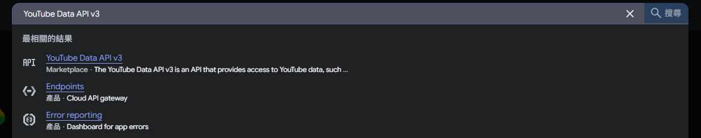
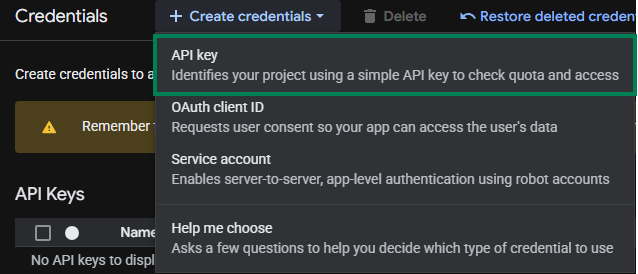

# YouTube API 設定

このチュートリアルでは、`配信ハイライトマーカー`機能に使用する YouTube Data API の **API Key** と**チャンネル ID** の取得方法を説明します。

## YouTube Data API

### ステップ 1：Google Cloud Console を開く

1. [Google Cloud Console](https://console.cloud.google.com) に移動します
2. Google アカウントでログインします

### ステップ 2：YouTube Data API v3 を有効にする

1. 上部の検索バーで `YouTube Data API v3` を検索します

   

2. 検索結果をクリックします
3. **Enable** をクリックします

   

### ステップ 3：API キーを作成する

1. 左側の **Credentials** をクリックします

   

2. **Create credentials** → **API Key** を選択します

   

### ステップ 4：API キーを設定する

1. **Name** は任意の名前を入力（例：`StreamToolkit`）
2. **Select API restrictions** で `YouTube Data API v3` にチェックを入れて **OK** を押します

   

3. **Authenticate API calls through a service account** はチェックしない
4. **Application restrictions** で **None** を選択

   

5. **Create** をクリックします

### ステップ 5：App に入力する

1. 取得した API Key を App の **YouTube API** 欄に貼り付けます

## チャンネル ID

### ステップ 1：YouTube の設定を開く

1. [YouTube](https://www.youtube.com) に移動します
2. 右上のプロフィール写真をクリックします
3. **設定** を選択します

### ステップ 2：チャンネル ID を取得

1. 左側のメニューから **詳細設定** を選択します

   

2. **チャンネル ID** をコピーして App に貼り付けます

   

## よくある質問

**Q：API キーに使用制限はありますか？**
はい。YouTube Data API v3 の無料枠は1日あたり 10,000 ユニットです。通常の配信での利用であれば超えることはありません。

**Q：「API Key が無効です」というエラーが表示されます。**
YouTube Data API v3 が有効になっており、かつ正しいプロジェクトのキーを使用しているか確認してください。

**Q：キーを公開しても大丈夫ですか？**
おすすめしません。キーが漏洩して悪用された場合、1日の配信配額（クォータ）がすぐに消費されてしまいます。
