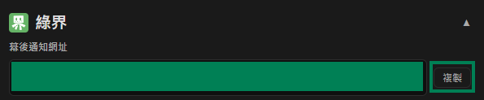

# ECPay 설정

이 튜토리얼은 ECPay에서 **HashKey**와 **HashIV**를 가져와 Stream Toolkit에 입력하는 방법을 설명합니다.

## 1단계: ECPay 가맹점 대시보드 로그인

1. [ECPay 공식 웹사이트](https://www.ecpay.com.tw/)로 이동합니다
2. 오른쪽 상단의 **판매자 로그인** → **가맹점 전용 구역**을 클릭합니다

## 2단계: 시스템 연동 설정 진입하기

1. 왼쪽 메뉴에서 **시스템 설정**을 클릭합니다
2. **시스템 연동 설정**을 선택합니다

   

3. **연동 Hash Key**와 **연동 Hash IV**를 찾습니다

   

## 3단계: Stream Toolkit에 입력하기

1. Stream Toolkit을 엽니다
2. 왼쪽 아래 메뉴에서 **설정**을 클릭합니다
3. **후원 플랫폼 연동**에서 **ECPay**를 찾습니다
4. **시스템 연동 설정**의 **연동 HashKey**와 **연동 HashIV**를 각각 **Hash Key**와 **Hash IV** 필드에 붙여넣습니다
5. **저장**을 클릭합니다

## 4단계: 알림 주소 설정하기

1. ECPay의 **백그라운드 알림 주소**를 복사합니다

   

2. ECPay 가맹점 대시보드에서 **결제 도구** → **스트리머 결제**를 찾으세요

   

3. **백그라운드 알림 주소**를 **결제 완료 알림 전송 주소** 필드에 붙여넣습니다

   

4. **설정 저장**을 클릭합니다

## 자주 묻는 질문

**Q: 로그인 후 "시스템 설정"이 보이지 않나요?**
계정 승인 절차가 완료되지 않았을 수 있습니다. "가맹점 정보 관리"에서 승인 상태를 확인해 주세요.

**Q: HashKey는 공개해도 되나요?**
아니요. HashKey와 HashIV는 비공개 키이므로 스크린샷을 공유하거나 공개적인 장소에 게시하지 마십시오.
