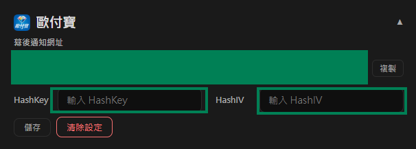

# O'Pay 설정

이 튜토리얼은 O'Pay에서 **HashKey**와 **HashIV**를 가져와 Stream Toolkit에 입력하는 방법을 설명합니다.

## 1단계: O'Pay 가맹점 대시보드 로그인

1. [O'Pay 공식 웹사이트](https://www.opay.tw/)로 이동하여 로그인합니다
2. 로그인 후 오른쪽 상단을 클릭하여 가맹점 대시보드로 진입합니다

   

:::note
아직 O'Pay 계정이 없는 경우, 먼저 상점 신청 및 신원 확인을 완료해야 합니다.
:::

## Passaggio 2: Gestione sviluppo sistema

1. 왼쪽 메뉴에서 **시스템 개발 관리**를 찾습니다
2. **시스템 연동 설정**을 클릭합니다

## 3단계: Stream Toolkit에 입력하기

1. Stream Toolkit을 엽니다
2. 왼쪽 아래 메뉴에서 **설정**을 클릭합니다
3. **후원 플랫폼 연동**에서 **O'Pay**를 찾습니다
4. **시스템 연동 설정**의 **ALL IN ONE 연동 HashKey**와 **ALL IN ONE 연동 HashIV**를 각각 **Hash Key**와 **Hash IV** 필드에 붙여넣습니다

   

5. **저장**을 클릭합니다

   

## 4단계: 알림 주소 설정하기

1. O'Pay의 **백그라운드 알림 주소**를 복사합니다

   

2. [O'Pay 공식 웹사이트](https://www.opay.tw/)로 돌아가 **결제 받기** → **스트리머 결제 설정**을 클릭합니다

   

3. **백그라운드 알림 주소**를 **후원 결제 성공 알림 주소** 필드에 붙여넣습니다

   

4. **설정 저장**을 클릭합니다

## 자주 묻는 질문

**Q: "시스템 개발 관리" 메뉴를 찾을 수 없나요?**
이는 계정이 아직 승인되지 않았거나 관련 결제 기능이 활성화되지 않았음을 의미합니다. O'Pay 고객 센터에 문의해 주세요.

**Q: HashKey는 공개해도 되나요?**
아니요. HashKey와 HashIV는 비공개 키이므로 스크린샷을 공유하거나 공개적인 장소에 게시하지 마십시오.
