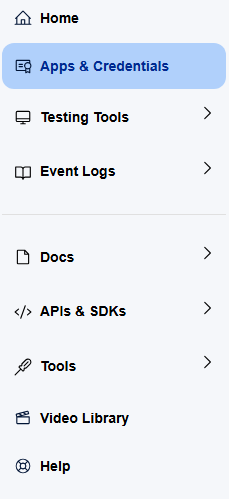
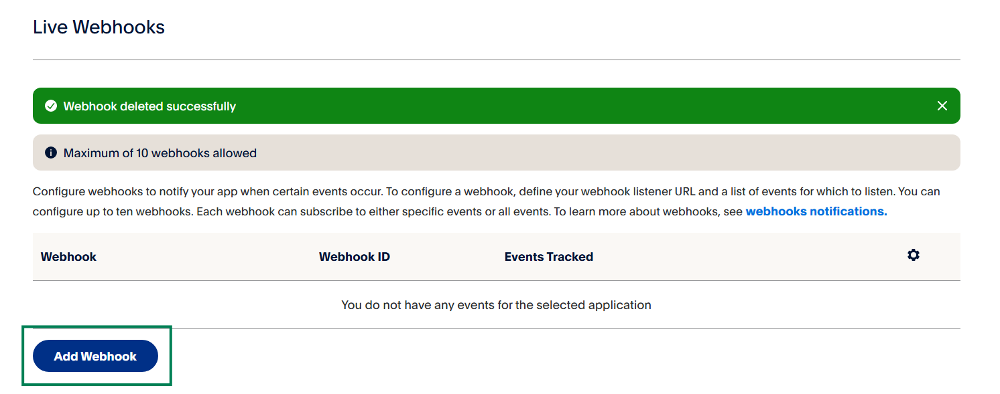

# Ustawienia PayPal

Stream Toolkit używa Webhooków do odbierania powiadomień o płatnościach PayPal, więc nie ma potrzeby wprowadzania klucza API.

## Krok 1: Uzyskaj adres URL Webhooka w Stream Toolkit

1. Otwórz Stream Toolkit
2. Kliknij **Ustawienia** w lewym dolnym menu
3. Znajdź **Integracja platform wsparć** → **PayPal**
4. Kliknij przycisk **Uzyskaj adres**
5. Po wygenerowaniu adresu URL kliknij przycisk **Kopiuj**

:::warning Uwaga
Adres URL Webhooka zawiera ekskluzywny token, nie udostępniaj go publicznie. Jeśli podejrzewasz wyciek, możesz kliknąć **Uzyskaj adres ponownie**, aby wygenerować nowy adres (stary adres natychmiast straci ważność).
:::

## Krok 2: Zaloguj się do panelu deweloperskiego PayPal

1. Przejdź do [PayPal Developer](https://developer.paypal.com)
2. Kliknij **Log in to Dashboard** w prawym górnym rogu i zaloguj się za pomocą konta PayPal
3. Po zalogowaniu kliknij przycisk **`</>`** w prawym górnym rogu, aby przejść do panelu deweloperského

## Krok 3: Przełącz na tryb Live

Upewnij się, że przełącznik trybu nad lewym menu jest ustawiony na **Live**. Przełączenie jest wymagane tylko wtedy, gdy wyświetla się **Sandbox** (tryb testowy):

1. Znajdź przełącznik nad lewym menu
2. Kliknij, aby przełączyć na **Live**

## Krok 4: Przejdź do ustawień Webhooków

1. W menu po lewej stronie kliknij **Apps & Credentials**

   

2. Znajdź na stronie przycisk **Manage Webhooks** i kliknij go, aby wejść

   

3. Przewiń na sam dół strony i kliknij **Add Webhook**

   

## Krok 5: Dodaj Webhook

1. Wklej adres URL skopiowany przed chwilą z Stream Toolkit w pole **Webhook URL**
2. W **Event types** znajdź kategorię **Payments & payouts** i zaznacz:
   - ✅ `Payment capture completed`
   - ✅ `Payment sale completed`
3. Kliknij **Save**

{/* TODO: 截圖 — Add Webhook 設定頁 */}

Po zakończeniu konfiguracji, gdy widzowie dokonają płatności za pośrednictwem PayPal, Stream Toolkit otrzyma powiadomienie w czasie rzeczywistym.

## Najczęściej zadawane pytania

**Q: Czy można testować w trybie Sandbox?**
Tak. W trybie Sandbox również można dodać Webhook, aby przetestować proces płatności, ale nie otrzymasz prawdziwych pieniędzy.

**Q: Co zrobić, jeśli adres URL Webhooka zostanie wygenerowany ponownie?**
Musisz wrócić do panelu PayPal i zmienić stary adres URL Webhooka na nowy.
