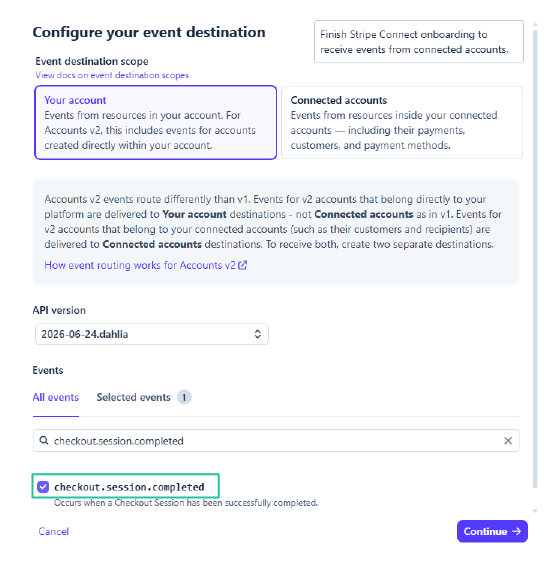

# Configurações do Stripe

O Stream Toolkit recebe notificações de pagamento do Stripe via Webhooks. A configuração é dividida em duas partes: obter a URL do Webhook no app e concluir a integração no painel do Stripe.

## Passo 1: Obter a URL do Webhook no Stream Toolkit

1. Abra o Stream Toolkit
2. Clique em **Configurações** no menu inferior esquerdo → **Integração de plataformas de doação** → **Stripe** (Clique para expandir)
3. Você verá a **Webhook URL**, formatada da seguinte maneira:
   ```
   https://<worker>/stripe/webhook/<your userId>
   ```
4. Clique no botão **Copiar** e salve esta URL para uso posterior


## Passo 2: Adicionar um Webhook no painel do Stripe

1. Acesse o [Stripe Dashboard](https://dashboard.stripe.com) e faça login na sua conta
2. Clique em **Desenvolvedores** → **Webhooks** no canto superior direito


3. Clique em **Adicionar endpoint**


4. Preencha as seguintes informações:
   - **Eventos**: Pesquise e marque `checkout.session.completed` (apenas este é necessário)

   

   - **Tipo de endpoint**: Selecione **Endpoint de Webhook**

   

   - **Nome do endpoint**: Preencha como desejar (por exemplo, `Stream Toolkit`)
   - **URL do endpoint**: Cole a URL do Webhook copiada no Passo 1

   

5. Clique em **Adicionar endpoint**

## Passo 3: Inserir o segredo de assinatura

1. Assim que o Webhook for criado, a página exibirá o **segredo de assinatura** no formato `whsec_...`
2. Copie este segredo
3. Volte para a seção de configurações do Stripe no Stream Toolkit
4. Cole o segredo no campo **Segredo de assinatura do Webhook**
5. Clique em **Salvar**

Se o status da conexão ficar verde, a configuração foi bem-sucedida.


## Concluído

Assim que a configuração estiver concluída, quando os espectadores pagarem pelo seu **Payment Link** do Stripe, o Stream Toolkit receberá notificações em tempo real e exibirá a doação.

## Perguntas Frequentes

**Q: Onde posso criar um Payment Link?**
Acesse o Stripe Dashboard → **Payment Links** → **Criar Payment Link**, defina o valor e compartilhe o link com seus espectadores.

**Q: O status da conexão não ficou verde?**
Certifique-se de que o Segredo de assinatura do Webhook tenha sido colado e salvo corretamente, e que a URL do endpoint no painel do Stripe corresponda exatamente à exibida no app.
