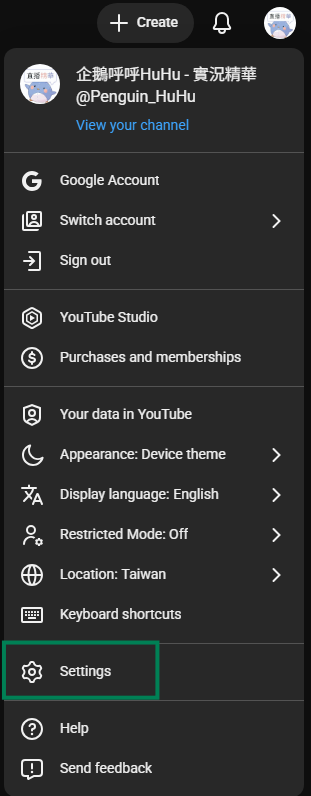

# Configurações da API do YouTube

Este tutorial explica como obter a **API Key** e o **ID do canal** da YouTube Data API, usados para o recurso `Marcador de destaques da stream`.

## YouTube Data API

### Passo 1: Abrir o Google Cloud Console

1. Acesse o [Google Cloud Console](https://console.cloud.google.com)
2. Faça login com sua conta do Google

### Passo 2: Ativar a YouTube Data API v3

1. Pesquise por `YouTube Data API v3` na barra de pesquisa superior

   

2. Clique no resultado da pesquisa
3. Clique em **Enable**

   

### Passo 3: Criar Chave API

1. Clique em **Credentials** à esquerda

   

2. Selecione **Create credentials** → **API Key**

   

### Passo 4: Configurar Chave API

1. Insira qualquer **Name** (por exemplo: `StreamToolkit`)
2. Em **Select API restrictions**, marque `YouTube Data API v3` e clique em **OK**

   

3. Deixe **Authenticate API calls through a service account** desmarcado
4. Em **Application restrictions** selecione **None**

   

5. Clique em **Create**

### Passo 5: Preencher no App

1. Cole a API Key obtida no campo **YouTube API** do App

## ID do canal

### Passo 1: Abrir as Configurações do YouTube

1. Acesse o [YouTube](https://www.youtube.com)
2. Clique na sua foto de perfil no canto superior direito
3. Selecione **Configurações**

### Passo 2: Obter ID do canal

1. Selecione **Configurações avançadas** no menu lateral esquerdo

   

2. Copie o **ID do canal** e cole de volta no App

   

## Perguntas Frequentes

**Q: A Chave API tem limites de uso?**
Sim. A YouTube Data API v3 possui uma cota diária gratuita de 10.000 unidades. O uso comum em transmissões não irá exceder esse limite.

**Q: Apareceu o erro "API Key inválida"?**
Certifique-se de que a YouTube Data API v3 está ativada e que você está usando a chave do projeto correto.

**Q: A chave pode ser tornada pública?**
Não recomendado. Se sua chave vazar e for abusada, sua cota diária será esgotada rapidamente.
