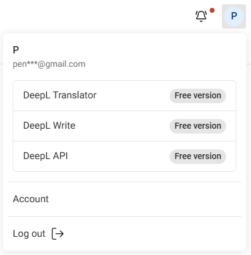

# Obtenção da chave API DeepL

A chave API DeepL é usada para a tradução automática dos seguintes recursos:
- **Tradução de voz** — Tradução automática após converter fala em texto
- **Chat** — Tradução automática de mensagens de espectadores

## Passo 1: Iniciar sessão na sua conta DeepL

Aceda ao [DeepL](https://www.deepl.com) e inicie sessão na sua conta. Se ainda não tem uma conta, precisa de se registar primeiro.

## Passo 2: Ir para as definições de Account

Clique no **ícone de perfil** no canto superior direito e selecione **Account**.

## Passo 3: Mudar para o separador API Keys & limits

Clique no separador **API Keys & limits**.

## Passo 4: Criar uma nova API Key

1. Clique em **Create key +**
2. **Name your key**: Insira qualquer nome (por exemplo, `Stream Toolkit`)
3. **Permissions**: Selecione **All access**
4. Clique em **Create Key**

## Passo 5: Copiar e colar na App

1. Copie a API Key gerada
2. Volte para o Stream Toolkit e cole no campo **DeepL API Key** correspondente

## Perguntas Frequentes

**Q: A versão de avaliação gratuita do DeepL tem limites de uso?**
Sim. A versão de avaliação gratuita oferece uma quota de 1.000.000 de caracteres e está limitada a um mês. Para continuar a utilizar uma tradução de alta qualidade, subscreva um plano pago do DeepL.

**Q: O que fazer se a minha API Key for divulgada?**
Volte para DeepL Account → API Keys & limita, elimine a Key antiga e crie uma nova.
