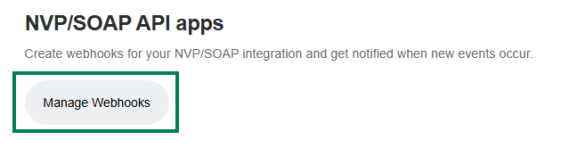

# Настройка PayPal

Stream Toolkit использует Webhook для получения уведомлений о платежах PayPal, поэтому вводить API-ключ не требуется.

## Шаг 1: Получите URL-адрес Webhook в Stream Toolkit

1. Откройте Stream Toolkit
2. Нажмите **Настройки** в левом нижнем меню
3. Найдите **Интеграция платформ донатов** → **PayPal**
4. Нажмите кнопку **Получить URL**
5. После генерации URL-адреса нажмите кнопку **Копировать**

:::warning Внимание
URL-адрес Webhook содержит эксклюзивный token, пожалуйста, не делитесь им публично. Если вы подозреваете утечку, вы можете нажать **Получить URL заново**, чтобы получить новый адрес (старый URL-адрес сразу же станет недействительным).
:::

## Шаг 2: Войдите в панель разработчика PayPal

1. Перейдите на [PayPal Developer](https://developer.paypal.com)
2. Нажмите **Log in to Dashboard** в правом верхнем углу и войдите с помощью аккаунта PayPal
3. После входа нажмите кнопку **`</>`** в правом верхнем углу, чтобы перейти в панель разработчика

## Шаг 3: Переключитесь в режим Live

Убедитесь, что переключатель режима над левым меню установлен в положение **Live**. Переключаться нужно только в том случае, если отображается **Sandbox** (тестовый режим):

1. Найдите тумблер переключения над левым меню
2. Нажмите, чтобы переключить в режим **Live**

## Шаг 4: Перейдите в настройки Webhooks

1. В левом меню нажмите **Apps & Credentials**

   

2. Найдите на странице кнопку **Manage Webhooks** и нажмите на нее, чтобы войти

   

3. Прокрутите страницу до самого низа и нажмите **Add Webhook**

   

## Шаг 5: Добавьте Webhook

1. Вставьте URL-адрес, который вы только что скопировали из Stream Toolkit, в поле **Webhook URL**
2. В **Event types** найдите категорию **Payments & payouts** и отметьте галочкой:
   - ✅ `Payment capture completed`
   - ✅ `Payment sale completed`
3. Нажмите **Save**

{/* TODO: 截圖 — Add Webhook 設定頁 */}

После завершения настроек, когда зрители будут совершать платежи через PayPal, Stream Toolkit будет получать уведомления в режиме реального времени.

## Часто задаваемые вопросы

**Q: Можно ли тестировать в режиме Sandbox?**
Да. В режиме Sandbox также можно добавить Webhook для тестирования процесса оплаты, но реальные средства списываться или зачисляться не будут.

**Q: Что делать, если URL-адрес Webhook был сгенерирован заново?**
Вам необходимо вернуться в панель управления PayPal и заменить старый URL-адрес Webhook на новый.
