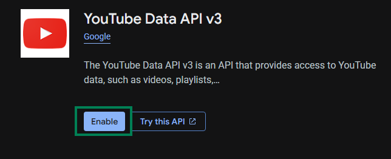

# Настройка YouTube API

В этом руководстве объясняется, как получить **API Key** и **ID канала** для YouTube Data API, которые используются для функции `Метка лучших моментов трансляции`.

## YouTube Data API

### Шаг 1: Откройте Google Cloud Console

1. Перейдите в [Google Cloud Console](https://console.cloud.google.com)
2. Войдите с помощью своего аккаунта Google

### Шаг 2: Включите YouTube Data API v3

1. Найдите `YouTube Data API v3` в верхней строке поиска

   

2. Нажмите на результат поиска
3. Нажмите **Enable**

   

### Шаг 3: Создайте API-ключ

1. Нажмите **Credentials** слева

   

2. Выберите **Create credentials** → **API Key**

   

### Шаг 4: Настройте API-ключ

1. Укажите любое **Name** (например: `StreamToolkit`)
2. В **Select API restrictions** отметьте `YouTube Data API v3` и нажмите **OK**

   

3. Оставьте **Authenticate API calls through a service account** неотмеченным
4. В **Application restrictions** выберите **None**

   

5. Нажмите **Create**

### Шаг 5: Введите данные в App

1. Вставьте полученный API Key в поле **YouTube API** в App

## ID канала

### Шаг 1: Откройте настройки YouTube

1. Перейдите на [YouTube](https://www.youtube.com)
2. Нажмите на фото профиля в правом верхнем углу
3. Выберите **Настройки**

### Шаг 2: Получите ID канала

1. В меню слева выберите **Расширенные настройки**

   

2. Скопируйте **ID канала** и вставьте его обратно в App

   

## Часто задаваемые вопросы

**Q: Есть ли лимиты на использование API-ключа?**
Да. YouTube Data API v3 имеет бесплатную ежедневную квоту в 10 000 единиц. Обычно использование при стримах этот лимит не превышает.

**Q: Появляется ошибка «Недействительный API Key»?**
Убедитесь, что YouTube Data API v3 включен и вы используете ключ от правильного проекта.

**Q: Можно ли публиковать ключ?**
Не рекомендуется. Если ваш ключ утечет и будет использован посторонними, ваша ежедневная квота быстро исчерпается.
