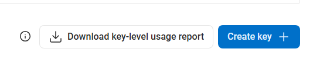

# Получение ключа DeepL API

DeepL API Key используется для автоматического перевода следующих функций:
- **Голосовой перевод** — Автоматический перевод после преобразования речи в текст
- **Чат** — Автоматический перевод сообщений зрителей

## Шаг 1: Войдите в свой аккаунт DeepL

Перейдите на [DeepL](https://www.deepl.com) и войдите в свой аккаунт. Если у вас еще нет аккаунта, вам нужно сначала зарегистрироваться.

## Шаг 2: Перейдите в настройки Account

Нажмите на **иконку профиля** в правом верхнем углу и выберите **Account**.

## Шаг 3: Перейдите на вкладку API Keys & limits

Нажмите на вкладку **API Keys & limits**.

## Шаг 4: Создайте новый API Key

1. Нажмите **Create key +**
2. **Name your key**: Введите любое имя (например, `Stream Toolkit`)
3. **Permissions**: Выберите **All access**
4. Нажмите **Create Key**

## Шаг 5: Скопируйте и вставьте в App

1. Скопируйте созданный API Key
2. Вернитесь в Stream Toolkit и вставьте в соответствующее поле **DeepL API Key**

## Часто задаваемые вопросы

**Q: Есть ли ограничения на использование в бесплатной пробной версии DeepL?**
Да. Бесплатная пробная версия предоставляет квоту в 1 000 000 символов и ограничена одним месяцем использования. Для продолжения использования высококачественного перевода, пожалуйста, оформите платную подписку DeepL.

**Q: Что делать, если мой API Key был скомпрометирован?**
Вернитесь в DeepL Account → API Keys & limits, удалите старый Key и создайте новый.
