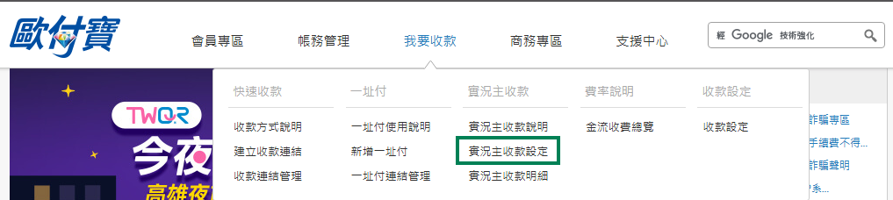

# O'Pay-inställningar

Denna handledning förklarar hur du hämtar **HashKey** och **HashIV** från O'Pay och anger dem i Stream Toolkit.

## Steg 1: Logga in på O'Pay Merchant Dashboard

1. Gå till [O'Pay:s officiella webbplats](https://www.opay.tw/) och logga in
2. Efter inloggning, klicka i det övre högra hörnet för att gå till merchant-dashboarden

   

:::note
Om du inte har ett O'Pay-konto ännu måste du först slutföra butiksansökan och identitetsverifiering.
:::

## Steg 2: Gå till 系統開發管理

1. Hitta **Systemutvecklingshantering** i vänstermenyn
2. Klicka på **Systemintegrationsinställningar**

## Steg 3: Ange i Stream Toolkit

1. Öppna Stream Toolkit
2. Klicka på **Inställningar** i den nedre vänstra menyn
3. Hitta **O'Pay** under **Donationsplattformar**
4. Klistra in **ALL IN ONE Integrations-HashKey** och **ALL IN ONE Integrations-HashIV** från **Systemintegrationsinställningar** i fälten **Hash Key** respektive **Hash IV**

   

5. Klicka på **Spara**

   

## Steg 4: Ställ in aviserings-URL

1. Kopiera O'Pay:s **Bakgrundsaviseringsadress**

   

2. Gå tillbaka till [O'Pay:s officiella webbplats](https://www.opay.tw/) och klicka på **Ta emot betalningar** → **Streamer-betalningsinställningar**

   

3. Klistra in **Bakgrundsaviseringsadress** i fältet **URL för avisering om lyckad donationsbetalning**

   

4. Klicka på **Spara inställningar**

## Vanliga frågor

**Q: Kan inte hitta menyn "Systemutvecklingshantering"?**
Det betyder att ditt konto ännu inte har godkänts, eller att relevanta betalningsfunktioner inte har aktiverats. Vänligen kontakta O'Pay kundtjänst.

**Q: Kan HashKey göras offentlig?**
Nej. HashKey och HashIV är privata nycklar; vänligen dela inte skärmdumpar eller publicera dem offentligt.
