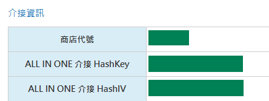

# การตั้งค่า O'Pay

บทเรียนนี้อธิบายวิธีรับ **HashKey** และ **HashIV** จาก O'Pay และกรอกลงใน Stream Toolkit

## ขั้นตอนที่ 1: ลงชื่อเข้าใช้หลังบ้านร้านค้าของ O'Pay

1. ไปที่ [เว็บไซต์ทางการของ O'Pay](https://www.opay.tw/) แล้วลงชื่อเข้าใช้
2. หลังจากลงชื่อเข้าใช้แล้ว ให้คลิกที่มุมขวาบนเพื่อเข้าสู่หลังบ้านร้านค้า

   

:::note
หากคุณยังไม่มีบัญชี O'Pay คุณต้องดำเนินการสมัครร้านค้าและยืนยันตัวตนให้เสร็จสิ้นก่อน
:::

## Bước 2: Quản lý phát triển hệ thống

1. ค้นหา **การจัดการการพัฒนาระบบ** ในเมนูด้านซ้าย
2. คลิก **การตั้งค่าการเชื่อมต่อระบบ**

## ขั้นตอนที่ 3: กรอกข้อมูลลงใน Stream Toolkit

1. เปิด Stream Toolkit
2. คลิกที่ **ตั้งค่า** ในเมนูด้านซ้ายล่าง
3. ค้นหา **O'Pay** ใน **การเชื่อมต่อแพลตฟอร์มสนับสนุน**
4. นำ **ALL IN ONE HashKey การเชื่อมต่อ** และ **ALL IN ONE HashIV การเชื่อมต่อ** จาก **การตั้งค่าการเชื่อมต่อระบบ** มาใส่ในช่อง **Hash Key** และ **Hash IV** ตามลำดับ

   

5. คลิก **บันทึก**

   

## ขั้นตอนที่ 4: ตั้งค่า URL การแจ้งเตือน

1. คัดลอก **URL แจ้งเตือนเบื้องหลัง** ของ O'Pay

   

2. กลับไปที่ [เว็บไซต์ทางการของ O'Pay](https://www.opay.tw/) แล้วคลิก **รับชำระเงิน** → **การตั้งค่าการรับเงินของสตรีมเมอร์**

   

3. วาง **URL แจ้งเตือนเบื้องหลัง** ลงในช่อง **URL แจ้งเตือนเมื่อชำระเงินสนับสนุนสำเร็จ**

   

4. คลิก **บันทึกการตั้งค่า**

## คำถามที่พบบ่อย

**Q: หาเมนู "การจัดการการพัฒนาระบบ" ไม่พบ?**
นั่นหมายความว่าบัญชีของคุณยังไม่ได้รับการอนุมัติ หรือยังไม่ได้เปิดใช้งานฟังก์ชันการชำระเงินที่เกี่ยวข้อง โปรดติดต่อฝ่ายบริการลูกค้าของ O'Pay

**Q: HashKey เปิดเผยเป็นสาธารณะได้ไหม?**
ไม่ได้ครับ HashKey และ HashIV เป็นคีย์ส่วนตัว โปรดอย่าแชร์ภาพหน้าจอหรือโพสต์ในที่สาธารณะ
