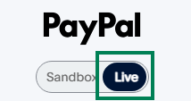

# การตั้งค่า PayPal

Stream Toolkit ใช้ Webhook ในการรับการแจ้งเตือนการชำระเงินของ PayPal ดังนั้นจึงไม่จำเป็นต้องกรอกคีย์ API

## ขั้นตอนที่ 1: รับ URL ของ Webhook ใน Stream Toolkit

1. เปิด Stream Toolkit
2. คลิกที่ **ตั้งค่า** ในเมนูด้านซ้ายล่าง
3. ค้นหา **การเชื่อมต่อแพลตฟอร์มสนับสนุน** → **PayPal**
4. คลิกปุ่ม **รับ URL**
5. หลังจากสร้าง URL แล้ว ให้คลิกปุ่ม **คัดลอก**

:::warning ข้อควรระวัง
URL ของ Webhook มี token เฉพาะตัว โปรดอย่าแชร์ต่อสาธารณะ หากสงสัยว่ารั่วไหล คุณสามารถคลิก **รับ URL ใหม่** เพื่อออก URL ใหม่ได้ (URL เก่าจะใช้งานไม่ได้ทันที)
:::

## ขั้นตอนที่ 2: ลงชื่อเข้าใช้หลังบ้านผู้พัฒนาของ PayPal

1. ไปที่ [PayPal Developer](https://developer.paypal.com)
2. คลิก **Log in to Dashboard** ที่มุมขวาบน แล้วลงชื่อเข้าใช้ด้วยบัญชี PayPal
3. หลังจากลงชื่อเข้าใช้ ให้คลิกปุ่ม **`</>`** ที่มุมขวาบนเพื่อเข้าสู่หลังบ้านผู้พัฒนา

## ขั้นตอนที่ 3: สลับเป็นโหมด Live

ตรวจสอบให้แน่ใจว่าสวิตช์โหมดที่อยู่เหนือเมนูด้านซ้ายถูกตั้งเป็น **Live** คุณจำเป็นต้องสลับโหมดก็ต่อเมื่อมันแสดงเป็น **Sandbox** (โหมดทดสอบ) เท่านั้น:

1. ค้นหาสวิตช์เปิด-ปิดที่อยู่เหนือเมนูด้านซ้าย
2. คลิกเพื่อสลับเป็น **Live**

## ขั้นตอนที่ 4: ไปที่การตั้งค่า Webhooks

1. คลิก **Apps & Credentials** ในเมนูด้านซ้าย

   

2. ค้นหาปุ่ม **Manage Webhooks** บนหน้าเว็บ แล้วคลิกเพื่อเข้าไป

   

3. เลื่อนลงไปที่ด้านล่างสุดของหน้า แล้วคลิก **Add Webhook**

   

## ขั้นตอนที่ 5: เพิ่ม Webhook

1. วาง URL ที่เพิ่งคัดลอกมาจาก Stream Toolkit ลงในช่อง **Webhook URL**
2. ใน **Event types** ให้ค้นหาหมวดหมู่ **Payments & payouts** แล้วติ๊กเลือก:
   - ✅ `Payment capture completed`
   - ✅ `Payment sale completed`
3. คลิก **Save**

{/* TODO: 截圖 — Add Webhook 設定頁 */}

เมื่อตั้งค่าเสร็จสิ้น เมื่อผู้ชมชำระเงินผ่าน PayPal ทาง Stream Toolkit จะได้รับการแจ้งเตือนในแบบเรียลไทม์ทันที

## คำถามที่พบบ่อย

**Q: สามารถทดสอบในโหมด Sandbox ได้ไหม?**
ได้ครับ ในโหมด Sandbox คุณสามารถเพิ่ม Webhook เพื่อทดสอบขั้นตอนการชำระเงินได้เช่นกัน แต่จะไม่ได้รับเงินจริง

**Q: หลังจากรับ URL ของ Webhook ใหม่แล้วต้องทำอย่างไร?**
ต้องกลับไปที่หลังบ้านของ PayPal เพื่อเปลี่ยน URL ของ Webhook เก่าให้เป็นอันใหม่
