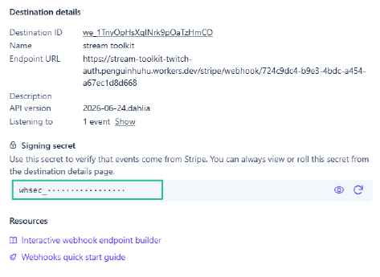

# การตั้งค่า Stripe

Stream Toolkit รับการแจ้งเตือนการชำระเงินของ Stripe ผ่าน Webhook การตั้งค่าแบ่งออกเป็นสองส่วน คือการรับ URL ของ Webhook จาก app และการเชื่อมต่อให้เสร็จสิ้นในหลังบ้านของ Stripe

## ขั้นตอนที่ 1: รับ URL ของ Webhook ใน Stream Toolkit

1. เปิด Stream Toolkit
2. คลิกที่ **ตั้งค่า** ในเมนูด้านซ้ายล่าง → **การเชื่อมต่อแพลตฟอร์มสนับสนุน** → **Stripe** (คลิกเพื่อขยาย)
3. จะเห็น **Webhook URL** มีรูปแบบดังนี้:
   ```
   https://<worker>/stripe/webhook/<your userId>
   ```
4. คลิกปุ่ม **คัดลอก** และบันทึก URL นี้ไว้ใช้สำรอง


## ขั้นตอนที่ 2: เพิ่ม Webhook ในหลังบ้านของ Stripe

1. ไปที่ [Stripe Dashboard](https://dashboard.stripe.com) แล้วลงชื่อเข้าใช้บัญชี
2. คลิกที่ **นักพัฒนา** → **Webhook** ที่มุมซ้ายล่าง


3. คลิก **เพิ่มปลายทาง**


4. กรอกข้อมูลต่อไปนี้:
   - **เหตุการณ์**: ค้นหาและติ๊กเลือก `checkout.session.completed` (ใช้เพียงแค่อันนี้อันเดียว)

   

   - **ประเภทปลายทาง**: เลือก **ปลายทาง Webhook**

   

   - **ชื่อปลายทาง**: กรอกได้ตามต้องการ (เช่น `Stream Toolkit`)
   - **URL ปลายทาง**: วาง URL ของ Webhook ที่คัดลอกมาจากขั้นตอนที่ 1

   

5. คลิก **เพิ่มปลายทาง**

## ขั้นตอนที่ 3: กรอกคีย์ลายเซ็น

1. หลังจากสร้าง Webhook เสร็จสิ้น หน้าเว็บจะแสดง **คีย์ลายเซ็น** ในรูปแบบ `whsec_...`
2. คัดลอกคีย์ชุดนี้
3. กลับไปที่ส่วนการตั้งค่า Stripe ของ Stream Toolkit
4. วางคีย์ลงในช่อง **คีย์ลายเซ็น Webhook**
5. คลิก **บันทึก**

เมื่อสถานะการเชื่อมต่อเปลี่ยนเป็นสีเขียว แสดงว่าการตั้งค่าสำเร็จแล้ว



## เสร็จสิ้น

เมื่อการตั้งค่าเสร็จสิ้น เมื่อผู้ชมชำระเงินผ่าน Stripe **Payment Link** ของคุณ Stream Toolkit จะได้รับ การแจ้งเตือนแบบเรียลไทม์และแสดงการโดเนททันที

## คำถามที่พบบ่อย

**Q: สร้าง Payment Link ได้ที่ไหน?**
ไปที่ Stripe Dashboard → **Payment Links** → **สร้าง Payment Link** ตั้งค่าจำนวนเงินแล้วแชร์ลิงก์ให้ผู้ชมได้เลย

**Q: สถานะการเชื่อมต่อไม่เปลี่ยนเป็นสีเขียว?**
ตรวจสอบให้แน่ใจว่าวาง คีย์ลายเซ็น Webhook และกดบันทึกอย่างถูกต้องแล้ว และ URL ปลายทางในหลังบ้านของ Stripe ตรงกับที่แสดงใน app ทุกประการ
