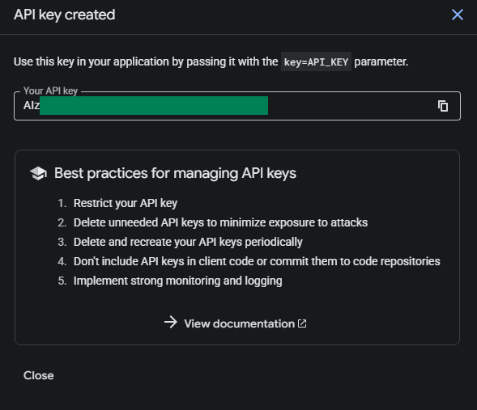

# การตั้งค่า YouTube API

บทเรียนนี้จะอธิบายวิธีการรับ **API Key** และ **รหัสช่อง** ของ YouTube Data API สำหรับใช้งานในฟังก์ชัน `ตัวทำเครื่องหมายไฮไลต์สตรีม`

## YouTube Data API

### ขั้นตอนที่ 1: เปิด Google Cloud Console

1. ไปที่ [Google Cloud Console](https://console.cloud.google.com)
2. ลงชื่อเข้าใช้ด้วยบัญชี Google ของคุณ

### ขั้นตอนที่ 2: เปิดใช้งาน YouTube Data API v3

1. ค้นหา `YouTube Data API v3` ในแถบค้นหาด้านบน

   

2. คลิกที่ผลลัพธ์การค้นหา
3. คลิก **Enable**

   

### ขั้นตอนที่ 3: สร้าง API Key

1. คลิก **Credentials** ทางด้านซ้าย

   

2. เลือก **Create credentials** → **API Key**

   

### ขั้นตอนที่ 4: ตั้งค่า API Key

1. ใส่ **Name** อะไรก็ได้ตามใจชอบ (เช่น: `StreamToolkit`)
2. ใน **Select API restrictions** ให้ติ๊กเลือก `YouTube Data API v3` แล้วกด **OK**

   

3. ไม่ต้องติ๊กเลือก **Authenticate API calls through a service account**
4. ใน **Application restrictions** ให้เลือก **None**

   

5. คลิก **Create**

### ขั้นตอนที่ 5: กรอกใน App

1. วาง API Key ที่ได้รับลงในช่อง **YouTube API** ใน App

## รหัสช่อง

### ขั้นตอนที่ 1: เปิดการตั้งค่า YouTube

1. ไปที่ [YouTube](https://www.youtube.com)
2. คลิกที่รูปโปรไฟล์ที่มุมขวาบน
3. เลือก **การตั้งค่า**

### ขั้นตอนที่ 2: รับ รหัสช่อง

1. เลือก **การตั้งค่าขั้นสูง** จากเมนูด้านซ้าย

   

2. คัดลอก **รหัสช่อง** แล้วนำไปวางใน App

   

## คำถามที่พบบ่อย

**Q: API Key มีจำกัดปริมาณการใช้งานไหม?**
มีครับ YouTube Data API v3 มีโควตาฟรี 10,000 หน่วยต่อวัน โดยทั่วไปการใช้งานสตรีมสดจะไม่เกินปริมาณนี้

**Q: เกิดข้อผิดพลาด "API Key ไม่ถูกต้อง"?**
ตรวจสอบให้แน่ใจว่าได้เปิดใช้งาน YouTube Data API v3 แล้ว และใช้คีย์ของโปรเจกต์ที่ถูกต้อง

**Q: สามารถเปิดเผยคีย์ต่อสาธารณะได้ไหม?**
ไม่แนะนำครับ หากคีย์รั่วไหลและถูกนำไปใช้ในทางที่ผิด โควตารายวันของคุณจะหมดลงอย่างรวดเร็ว
