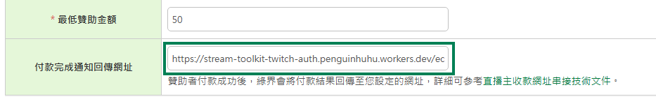

# ECPay Ayarları

Bu eğitim, ECPay'den **HashKey** ve **HashIV** bilgilerini nasıl alacağınızı ve Stream Toolkit'e nasıl gireceğinizi açıklar.

## Adım 1: ECPay Üye İş yeri Paneline Giriş Yapın

1. [ECPay resmi web sitesine](https://www.ecpay.com.tw/) gidin
2. Sağ üst köşedeki **Satıcı Girişi** → **Üye İş yeri Bölgesi** seçeneğine tıklayın

## Adım 2: Sistem Entegrasyon Ayarları bölümüne gidin

1. Sol menüdeki **Sistem Ayarları** seçeneğine tıklayın
2. **Sistem Entegrasyon Ayarları** seçeneğini belirleyin

   

3. **Entegrasyon Hash Key** ve **Entegrasyon Hash IV** bilgilerini bulun

   

## Adım 3: Stream Toolkit'e girin

1. Stream Toolkit'ı açın
2. Sol alt menüdeki **Ayarlar** seçeneğine tıklayın
3. **Bağış platformu entegrasyonu** içinde **ECPay**'i bulun
4. **Sistem Entegrasyon Ayarları** kısmındaki **Entegrasyon HashKey** ve **Entegrasyon HashIV** değerlerini sırasıyla **Hash Key** ve **Hash IV** alanlarına yapıştırın
5. **Kaydet** butonuna tıklayın

## Adım 4: Bildirim URL'sini Ayarlayın

1. ECPay **Arka plan bildirim adresi** bilgisini kopyalayın

   

2. ECPay üye iş yeri panelinde **Ödeme Araçları** → **Yayıncı Ödemeleri** seçeneğini bulun

   

3. **Arka plan bildirim adresi** bilgisini **Ödeme Tamamlandı Bildirim Geri Dönüş URL'si** alanına yapıştırın

   

4. **Ayarları Kaydet** butonuna tıklayın

## Sıkça Sorulan Sorular

**Q: Giriş yaptıktan sonra "Sistem Ayarları" görünmüyor mu?**
Hesabınızın doğrulama süreci henüz tamamlanmamış olabilir. Durumu kontrol etmek için lütfen "Üye İş yeri Veri Yönetimi" bölümüne gidin.

**Q: HashKey herkese açık olabilir mi?**
Hayır. HashKey ve HashIV özel anahtarlardır; lütfen ekran görüntülerini paylaşmayın veya herkese açık yerlerde yayınlamayın.
