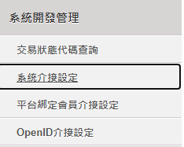

# O'Pay Ayarları

Bu eğitim, O'Pay'den **HashKey** ve **HashIV** bilgilerini nasıl alacağınızı ve Stream Toolkit'e nasıl gireceğinizi açıklar.

## Adım 1: O'Pay Üye İş yeri Paneline Giriş Yapın

1. [O'Pay resmi web sitesine](https://www.opay.tw/) gidin ve giriş yapın
2. Giriş yaptıktan sonra üye iş yeri paneline girmek için sağ üst köşeye tıklayın

   

:::note
Henüz bir O'Pay hesabınız yoksa, önce mağaza başvurunuzu ve kimlik doğrulamanızı tamamlamanız gerekir.
:::

## Langkah 2: Manajemen Pengembangan Sistem

1. Sol menüde **Sistem Geliştirme Yönetimi** seçeneğini bulun
2. **Sistem Entegrasyon Ayarları** seçeneğine tıklayın

## Adım 3: Stream Toolkit'e girin

1. Stream Toolkit'ı açın
2. Sol alt menüdeki **Ayarlar** seçeneğine tıklayın
3. **Bağış platformu entegrasyonu** içinde **O'Pay**'i bulun
4. **Sistem Entegrasyon Ayarları** kısmındaki **ALL IN ONE Entegrasyon HashKey** ve **ALL IN ONE Entegrasyon HashIV** değerlerini sırasıyla **Hash Key** ve **Hash IV** alanlarına yapıştırın

   

5. **Kaydet** butonuna tıklayın

   

## Adım 4: Bildirim URL'sini Ayarlayın

1. O'Pay **Arka plan bildirim adresi** bilgisini kopyalayın

   

2. [O'Pay resmi web sitesine](https://www.opay.tw/) geri dönün ve **Ödeme Al** → **Yayıncı Ödeme Ayarları** seçeneğine tıklayın

   

3. **Arka plan bildirim adresi** bilgisini **Başarılı bağış ödemesi bildirim URL'si** alanına yapıştırın

   

4. **Ayarları Kaydet** butonuna tıklayın

## Sıkça Sorulan Sorular

**Q: "Sistem Geliştirme Yönetimi" menüsü bulunamadı mı?**
Bu, hesabınızın henüz onaylanmadığı veya ilgili ödeme özelliklerinin etkinleştirilmediği anlamına gelir. Lütfen O'Pay müşteri hizmetleri ile iletişime geçin.

**Q: HashKey herkese açık olabilir mi?**
Hayır. HashKey ve HashIV özel anahtarlardır; lütfen ekran görüntülerini paylaşmayın veya herkese açık yerlerde yayınlamayın.
