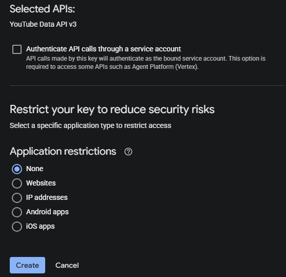
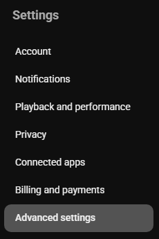

# YouTube API Ayarları

Bu eğitici içerik, `Yayın öne çıkan an işaretleyicisi` özelliği için kullanılan YouTube Data API **API Key** ve **Kanal Kimliği** bilgilerinin nasıl alınacağını açıklar.

## YouTube Data API

### Adım 1: Google Cloud Console'u Açın

1. [Google Cloud Console](https://console.cloud.google.com) adresine gidin
2. Google hesabınızla giriş yapın

### Adım 2: YouTube Data API v3'ü Etkinleştirin

1. Üstteki arama çubuğunda `YouTube Data API v3` ifadesini arayın

   

2. Arama sonucuna tıklayın
3. **Enable** butonuna tıklayın

   

### Adım 3: API Anahtarı Oluşturun

1. Sol taraftaki **Credentials** seçeneğine tıklayın

   

2. **Create credentials** → **API Key** seçeneğine tıklayın

   

### Adım 4: API Anahtarını Yapılandırın

1. **Name** kısmını istediğiniz gibi doldurun (örneğin: `StreamToolkit`)
2. **Select API restrictions** kısmında `YouTube Data API v3` seçeneğini işaretleyip **OK** butonuna tıklayın

   

3. **Authenticate API calls through a service account** seçeneğini işaretlemeyin
4. **Application restrictions** kısmında **None** seçeneğini seçin

   

5. **Create** butonuna tıklayın

### Adım 5: App İçine Girin

1. Elde ettiğiniz API Key bilgisini App içindeki **YouTube API** alanına yapıştırın

## Kanal Kimliği

### Adım 1: YouTube Ayarlarını Açın

1. [YouTube](https://www.youtube.com) adresine gidin
2. Sağ üst köşedeki profil resminize tıklayın
3. **Ayarlar** seçeneğini belirleyin

### Adım 2: Kanal Kimliğini Alın

1. Sol menüden **Gelişmiş ayarlar** seçeneğini belirleyin

   

2. **Kanal Kimliği** bilgisini kopyalayıp App içine yapıştırın

   

## Sıkça Sorulan Sorular

**Q: API Anahtarının kullanım sınırı var mı?**
Evet. YouTube Data API v3 günlük 10.000 birimlik ücretsiz kotalıdır. Normal yayın kullanımında bu sınır aşılmaz.

**Q: "Geçersiz API Key" hatası mı alıyorsunuz?**
YouTube Data API v3'ün etkinleştirildiğinden ve doğru projenin anahtarını kullandığınızdan emin olun.

**Q: Anahtar herkese açık olarak paylaşılabilir mi?**
Tavsiye edilmez. Anahtarınız sızdırılır ve kötüye kullanılırsa günlük kotanız hızla tükenir.
