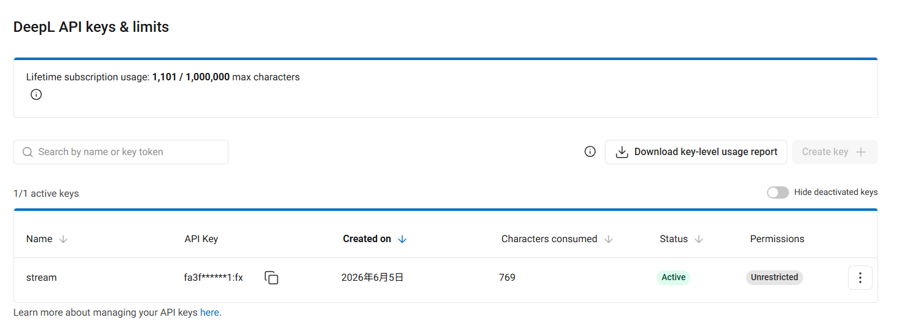

# DeepL API Key Edinme

DeepL API Key, aşağıdaki özelliklerin otomatik çevirisi için kullanılır:
- **Sesli çeviri** — Konuşmayı metne dönüştürdükten sonra otomatik çeviri
- **Chat** — İzleyici mesajlarının otomatik çevirisi

## Adım 1: DeepL hesabınıza giriş yapın

[DeepL](https://www.deepl.com) adresine gidin ve hesabınıza giriş yapın. Henüz bir hesabınız yoksa, önce kayıt olmanız gerekir.

## Adım 2: Account ayarlarına gidin

Sağ üst köşedeki **profil simgesine** tıklayın ve **Account** seçeneğini belirleyin.

## Adım 3: API Keys & limits sekmesine geçin

**API Keys & limits** sekmesine tıklayın.

## Adım 4: Yeni bir API Key oluşturun

1. **Create key +** seçeneğine tıklayın
2. **Name your key**: İstediğiniz bir adı girin (örneğin `Stream Toolkit`)
3. **Permissions**: **All access** seçeneğini belirleyin
4. **Create Key** seçeneğine tıklayın

## Adım 5: Kopyalayın ve App içine yapıştırın

1. Oluşturulan API Key değerini kopyalayın
2. Stream Toolkit'e dönün ve ilgili **DeepL API Key** alanına yapıştırın

## Sıkça Sorulan Sorular

**Q: DeepL ücretsiz deneme sürümünün kullanım limitleri var mı?**
Evet. Ücretsiz deneme sürümü 1.000.000 karakter kotası sunar ve bir ayla sınırlıdır. Yüksek kaliteli çevirileri kullanmaya devam etmek için lütfen bir DeepL ücretli planına abone olun.

**Q: API Key'im sızdırılırsa ne yapmalıyım?**
DeepL Account → API Keys & limits bölümüne dönün, eski Key değerini silin ve yeni bir tane oluşturun.
