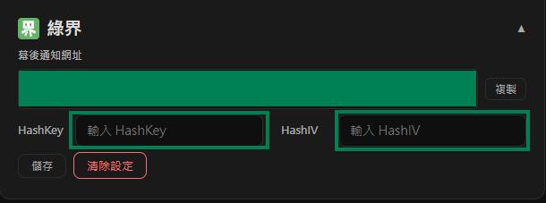

# Cài đặt ECPay

Hướng dẫn này giải thích cách lấy **HashKey** và **HashIV** từ ECPay và nhập vào Stream Toolkit.

## Bước 1: Đăng nhập vào trang quản trị đối tác ECPay

1. Truy cập [trang web chính thức của ECPay](https://www.ecpay.com.tw/)
2. Nhấp vào góc trên bên phải **Đăng nhập người bán** → **Khu vực đối tác**

## Bước 2: Truy cập Cài đặt tích hợp hệ thống

1. Nhấp vào **Cài đặt hệ thống** trong menu bên trái
2. Chọn **Cài đặt tích hợp hệ thống**

   

3. Tìm **Hash Key tích hợp** và **Hash IV tích hợp**

   

## Bước 3: Nhập vào Stream Toolkit

1. Mở Stream Toolkit
2. Nhấp vào **Cài đặt** ở menu phía dưới bên trái
3. Tìm **ECPay** trong **Kết nối nền tảng ủng hộ**
4. Dán **HashKey tích hợp** và **HashIV tích hợp** từ **Cài đặt tích hợp hệ thống** vào các trường **Hash Key** và **Hash IV** tương ứng
5. Nhấp vào **Lưu**

## Bước 4: Thiết lập URL thông báo

1. Sao chép **URL thông báo nền** của ECPay

   

2. Trong trang quản trị đối tác ECPay, tìm **Công cụ thanh toán** → **Thanh toán streamer**

   

3. Dán **URL thông báo nền** vào trường **URL phản hồi thông báo thanh toán hoàn tất**

   

4. Nhấp vào **Lưu thiết lập**

## Câu hỏi thường gặp

**Q: Không thấy "Cài đặt hệ thống" sau khi đăng nhập?**
Tài khoản của bạn có thể chưa hoàn tất quá trình xác minh. Vui lòng truy cập "Quản lý dữ liệu đối tác" để kiểm tra trạng thái.

**Q: HashKey có thể công khai không?**
Không. HashKey và HashIV là các khóa bảo mật; vui lòng không chia sẻ ảnh chụp màn hình hoặc đăng tải ở nơi công cộng.
