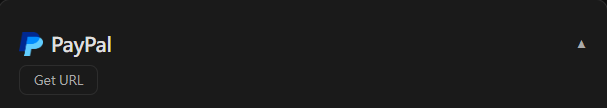

# PayPal 设置

Stream Toolkit 使用 Webhook 接收 PayPal 付款通知，不需要填入 API 金钥。

## 步骤一：在 Stream Toolkit 取得 Webhook 网址

1. 开启 Stream Toolkit
2. 点选左下菜单的 **设置**
3. 找到 **赞助平台对接** → **PayPal**
4. 点击 **获取网址** 按钮
5. 网址产生后，点击 **复制** 按钮

:::warning 注意
Webhook 网址含有专属 token，请勿公开分享。若怀疑外泄，可点击**重新获取网址**换发新网址（旧网址会立即失效）。
:::

## 步骤二：登录 PayPal 开发者后台

1. 前往 [PayPal Developer](https://developer.paypal.com)
2. 点击右上角 **Log in to Dashboard**，用 PayPal 账号登录
3. 登录后点击右上角的 **`</>`** 按钮进入开发者后台

## 步骤三：切换到 Live 模式

确认左侧菜单上方的模式开关是 **Live**。如果显示为 **Sandbox**（测试模式），才需要切换：

1. 找到左侧菜单上方的切换开关
2. 点击切换为 **Live**

## 步骤四：前往 Webhooks 设置

1. 左侧菜单点击 **Apps & Credentials**

   

2. 页面中找到 **Manage Webhooks** 按钮，点击进入

   

3. 滑到页面最下方，点击 **Add Webhook**

   

## 步骤五：新增 Webhook

1. 在 **Webhook URL** 栏位贴上刚才从 Stream Toolkit 复制的网址
2. 在 **Event types** 找到 **Payments & payouts** 分类，勾选：
   - ✅ `Payment capture completed`
   - ✅ `Payment sale completed`
3. 点击 **Save**

{/* TODO: 截圖 — Add Webhook 設定頁 */}

设置完成后，观众透过 PayPal 付款，Stream Toolkit 就会即时收到通知。

## 常见问题

**Q：Sandbox 模式可以测试吗？**
可以。在 Sandbox 模式下同样可以新增 Webhook，用于测试付款流程，但不会收到真实款项。

**Q：Webhook 网址重新产生后怎么办？**
需要回到 PayPal 后台，把旧的 Webhook 网址改成新的。
